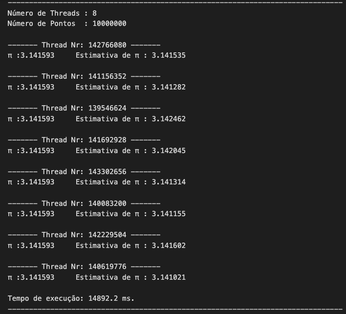

# PiValue
Monte Carlo simulation algorithm for estimating the value of π

PROBLEM
========

* It is intended to implement the Monte Carlo simulation algorithm to estimate the value of π, using multiple threads in order to parallelize the task.

Expected Result
------------------

Comments
------------
* The number of threads and points are preponderant in two ways, the more points you have the more accurate it turns out to be, ie, the estimated value of pi is closer to the real value, and that the number of threads has a significant impact on the time of execution.
